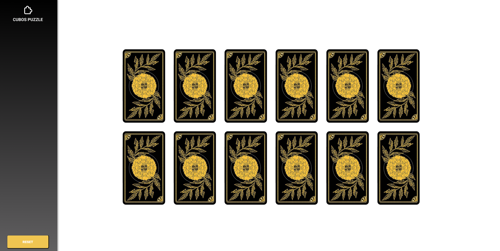

# Cubos Puzzle
Este foi um mini-desafio que eu fiz para praticar Estados no ReactJS.  
O objetivo era desenvolver um simples jogo da memória onde o usuário pode clicar em cada uma e tentar fazer o "match" com alguma carta.
  

